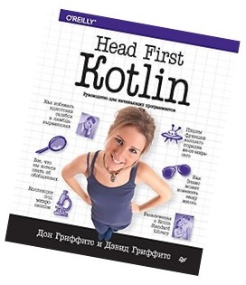

  
<h1>Изучение Kotlin по книге Head First Kotlin </h1>Данный репозиторий представляет собой реализованые проекты во время обучения языку программирования Kotlin по книге Head First Kotlin.

---
#### Данный репозиторий представляет собой реализованые проекты во время обучения ЯП kotlin по книге Head First Kotlin.
---
Содержание:
---
- [ ] Первые шаги. Не теряя времени 
- Решения
- Развлечения с магнитами
- [ ] Базовые типы и переменные. Из жизни переменных 
- [ ] Функции. За пределами main 
- [ ] Классы и объекты. Высокий класс 
- [ ] Подклассы и суперклассы. Наследование 
- [ ] Абстрактные классы и интерфейсы. Серьезно о полиморфизме 
- [ ] Классы данных. Работа с данными 
- [ ] Null и исключения. В целости и сохранности 
- [ ] Коллекции. Порядок превыше всего 
- [ ] Обобщения. На каждый вход знай свой выход 
- [ ] Лямбда-выражения и функции высшего порядка. Обработка кода как данных 
- [ ] Встроенные функции высшего порядка. Расширенные возможности 
- [ ] Приложение I. Сопрограммы. Параллельный запуск 
- [ ] Приложение II. Тестирование. Код под контролем 
- [ ] Приложение III. Остатки. Топ-10 тем, которые мы не рассмотрели

